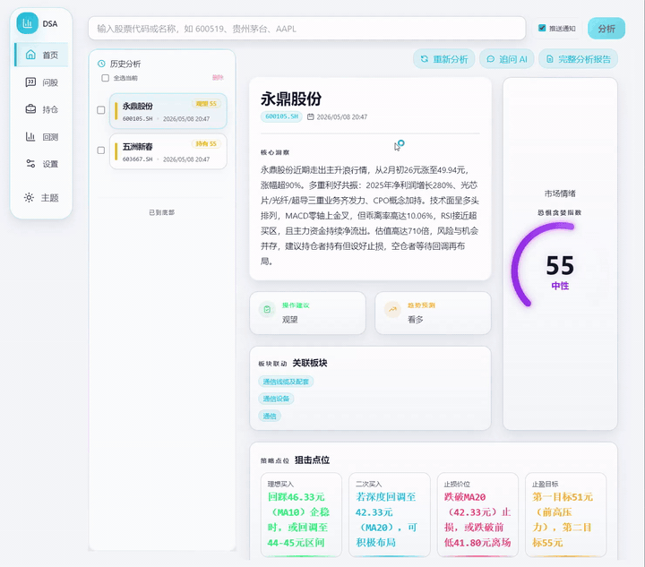
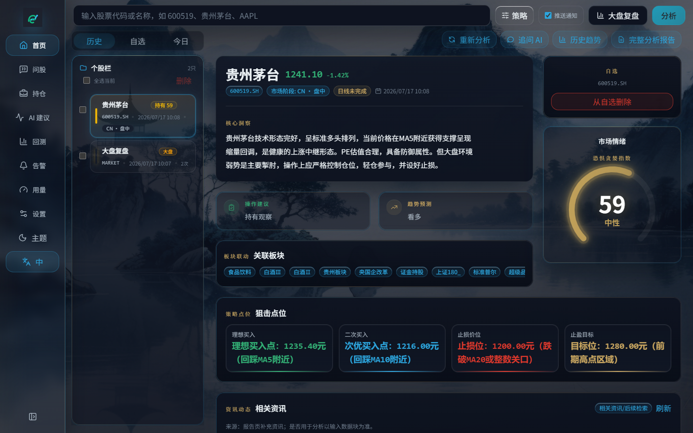
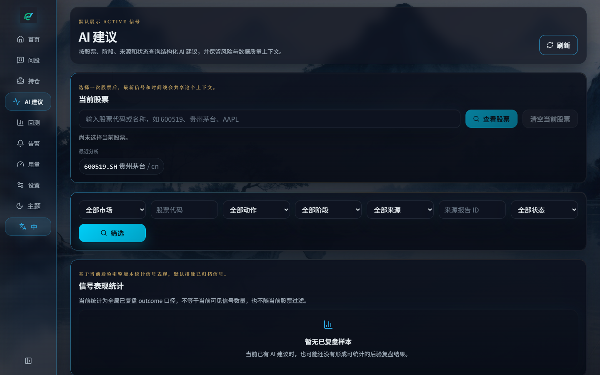
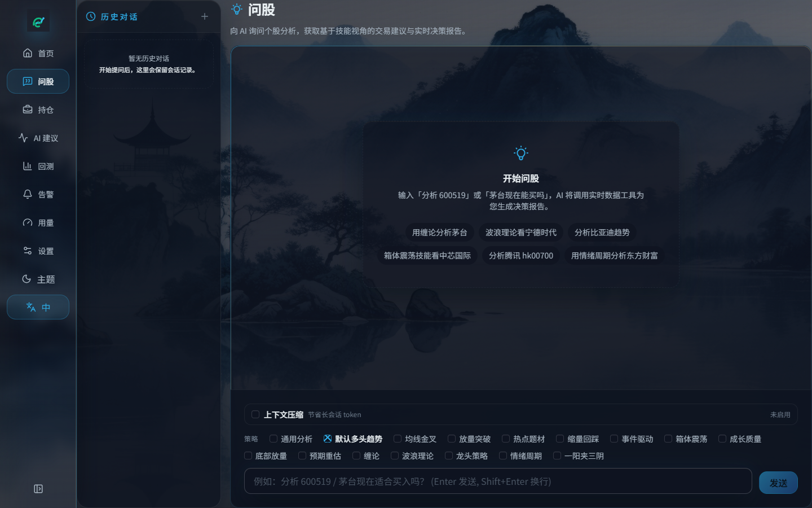
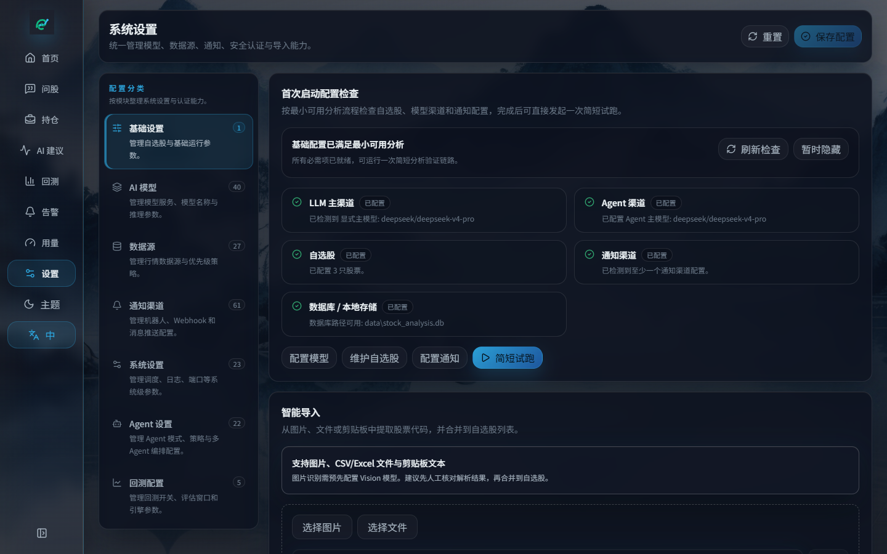
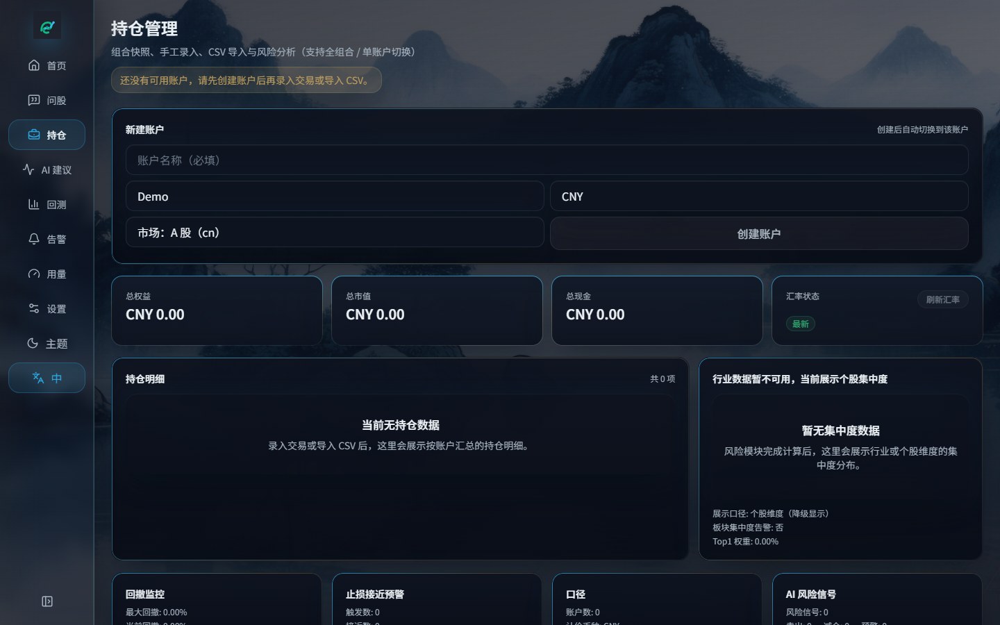
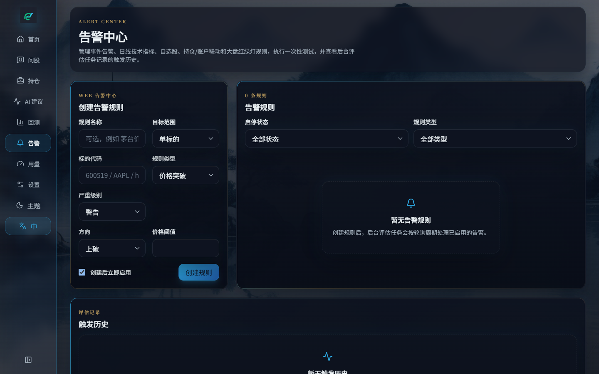
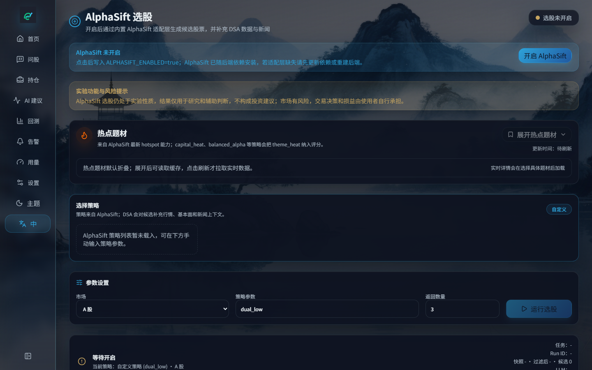

<div align="center">


# 📈 如意金股（RuyiDailyStockAnalysis）

> 作者：creeper　·　基于开源项目 [daily_stock_analysis](https://github.com/ZhuLinsen/daily_stock_analysis) 的二开版本

[](https://opensource.org/licenses/MIT)
[](https://www.python.org/downloads/)
[](docs/desktop-package.md)
[](https://github.com/VCsram/RuyiDailyStockAnalysis)
[](https://gitcode.com/VCVC_VC/RuyiDailyStockAnalysis)

**AI 驱动的 A 股 / 港股 / 美股 / 日股 / 韩股 / 台股自选股分析系统**

抓取行情 → 技术分析与新闻检索 → 大模型决策报告 → Web / 桌面工作台 → 多渠道推送

[**产品截图**](#-产品截图) · [**功能特性**](#-功能特性) · [**快速开始**](#-快速开始) · [**桌面端**](#-桌面端-v100) · [**文档中心**](docs/INDEX.md)

简体中文 | [English](docs/README_EN.md) | [繁體中文](docs/README_CHT.md)

</div>

## 🖥️ 产品截图

<p align="center">
  
</p>

| 首页工作台 | 登录 / 品牌页 |
|:---:|:---:|
|  |  |

| AI 建议 | Agent 问股 |
|:---:|:---:|
|  |  |

| 系统设置 | 持仓管理 |
|:---:|:---:|
|  |  |

| 告警中心 | 回测 |
|:---:|:---:|
|  |  |

<p align="center">
  <br>
  <sub>选股（AlphaSift）</sub>
</p>

## ✨ 功能特性

| 能力 | 覆盖内容 |
|------|------|
| AI 决策报告 | 核心结论、评分、趋势、买卖点位、风险警报、催化因素、操作检查清单 |
| AI 建议闭环 | 结构化决策信号、时间线、风格重评估预览、反馈与后验统计 |
| 多市场数据 | A 股 / 港股 / 美股 / 日股 / 韩股 / 台股与 ETF；行情、K 线、技术指标、新闻、基本面 |
| Web / 桌面工作台 | 手动分析、任务进度、历史报告、回测、持仓、告警、配置管理、浅色 / 深色主题 |
| Agent 策略问股 | 多轮追问，15+ 内置策略（均线、缠论、波浪、热点、事件等） |
| 自动化与推送 | GitHub Actions、Docker、本地定时、FastAPI；企业微信 / 飞书 / Telegram / Discord / Slack / 邮件 |

> 更细配置、字段契约与部署说明见 [完整指南](docs/full-guide.md)。

### 技术栈与数据来源

| 类型 | 支持 |
|------|------|
| AI 模型 | Anspire、AIHubMix、Gemini、OpenAI 兼容、DeepSeek、通义千问、Claude、Ollama 等 |
| 行情数据 | TickFlow、AkShare、Tushare、Pytdx、Baostock、YFinance、Longbridge |
| 新闻搜索 | Anspire、SerpAPI、Tavily、Bocha、Brave、MiniMax、SearXNG |

## 🚀 快速开始

### 方式一：桌面端（推荐本机一键体验）

本地已打包 **v1.0.0** Windows 安装包：

```text
apps/dsa-desktop/dist/daily-stock-analysis-windows-installer-v1.0.0.exe
```

1. 双击安装（可自选安装目录）
2. 启动后在 **系统设置** 填写模型 API Key（如 `GEMINI_API_KEY` / `DEEPSEEK_API_KEY` / `OPENAI_API_KEY`）
3. 配置自选股 `STOCK_LIST`，即可分析

免安装版：解压 `apps/dsa-desktop/dist/win-unpacked/`，双击 `Daily Stock Analysis.exe`。

详细说明：[桌面端打包文档](docs/desktop-package.md)

### 方式二：本地源码运行

```bash
# GitHub
git clone https://github.com/VCsram/RuyiDailyStockAnalysis.git
cd RuyiDailyStockAnalysis

# 或 GitCode
# git clone https://gitcode.com/VCVC_VC/RuyiDailyStockAnalysis.git

pip install -r requirements.txt
cp .env.example .env   # 编辑 API Key 与 STOCK_LIST
python main.py --serve-only
```

浏览器打开 `http://127.0.0.1:8000`。

常用命令：

```bash
python main.py --debug
python main.py --dry-run
python main.py --stocks 600519,hk00700,AAPL
python main.py --market-review
python main.py --schedule
python main.py --serve-only
```

### 方式三：GitHub Actions / Docker

Fork 或导入本仓库后，在 Actions Secrets 中配置至少一个模型 Key、`STOCK_LIST`，以及可选通知渠道。详见 [完整指南](docs/full-guide.md)。

Docker、云服务器与定时任务同样见完整指南。

## ⚙️ 配置要点

至少配置一个大模型 Key（示例）：

| 变量 | 说明 |
|------|------|
| `GEMINI_API_KEY` | Google Gemini |
| `DEEPSEEK_API_KEY` | DeepSeek |
| `OPENAI_API_KEY` + `OPENAI_BASE_URL` | OpenAI / 中转站 |
| `ANSPIRE_API_KEYS` | Anspire 一站式模型 + 搜索 |
| `STOCK_LIST` | 自选股，如 `600519,hk00700,AAPL` |

完整环境变量、通知渠道、数据源 fallback 见 [完整配置指南](docs/full-guide.md) 与 [LLM 配置指南](docs/LLM_CONFIG_GUIDE.md)。

## 🖥️ 桌面端 v1.0.0

| 产物 | 路径 |
|------|------|
| Windows 安装包 | `apps/dsa-desktop/dist/daily-stock-analysis-windows-installer-v1.0.0.exe` |
| 免安装目录 | `apps/dsa-desktop/dist/win-unpacked/` |

自行打包：

```powershell
# 建议使用 Python 3.10+
$env:PYTHON_BIN = "python"
$env:DSA_SKIP_DEVMODE_CHECK = "true"
powershell -ExecutionPolicy Bypass -File scripts\build-all.ps1
```

## 📱 推送效果示例

```
🎯 决策仪表盘
共分析 3 只股票 | 🟢买入:0 🟡观望:2 🔴卖出:1

⚪ 贵州茅台 (600519): 持有 | 评分 59 | 看多
...
```

## 🤖 Agent 策略问股

配置任意可用 AI API Key 后，打开 Web `/chat` 即可使用：

- 均线金叉、缠论、波浪、多头趋势、热点题材、事件驱动等内置策略
- 实时行情 / K 线 / 新闻 / 风险信息
- 多轮追问、会话导出、推送到通知渠道

## 📬 仓库与反馈

| 渠道 | 地址 |
|------|------|
| GitHub | https://github.com/VCsram/RuyiDailyStockAnalysis |
| GitCode | https://gitcode.com/VCVC_VC/RuyiDailyStockAnalysis |
| 上游原项目 | https://github.com/ZhuLinsen/daily_stock_analysis |

问题反馈请在本仓库提交 Issue。

## 📄 License

[MIT License](LICENSE) © 2026 creeper（二开） / 上游 © ZhuLinsen

欢迎在二次开发或引用时注明来源。

## ⚠️ 免责声明

本项目仅供学习和研究使用，不构成任何投资建议。股市有风险，投资需谨慎。作者不对使用本项目产生的任何损失负责。
