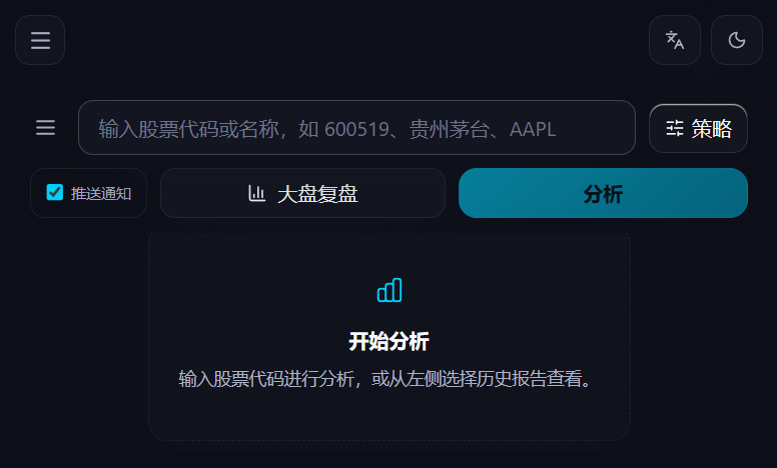
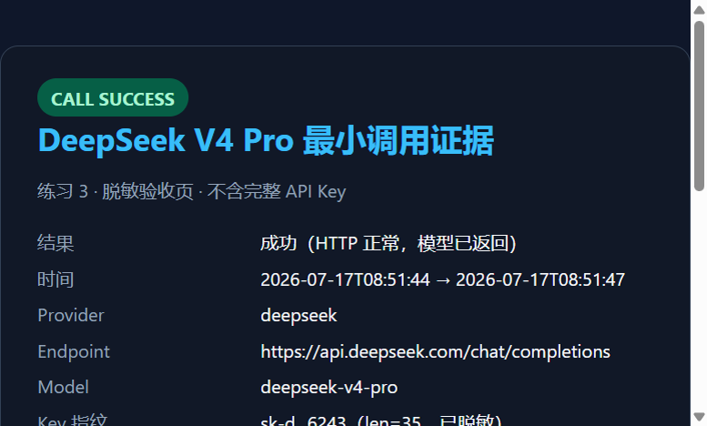

# 大模型在本项目的作用

> 面向「如意每日金股分析系统 / RuyiDailyStockAnalysis」  
> 覆盖：**分析（Analysis）· Agent 问股 · 报告（Reporting）· 问答（Q&A）**  
> 本练习已接通 DeepSeek V4 Pro（配置见同目录《本项目如何配置大模型.md》）。

## 1. 一句话定位

大模型不是行情源，也不替代均线/筹码等规则指标计算。  
它负责把「行情 + 新闻/情报 + 技术结论」加工成**可读的决策语义**：评分、建议、风险点、催化因素，并支撑多轮问股与工具调用。

主链路：

```text
抓取数据 → 技术分析/新闻检索 → LLM 分析 → 报告渲染/通知推送
```



---

## 2. Analysis｜个股 / 大盘分析

### 做什么

- **个股分析（默认路径）**：`GeminiAnalyzer`（经 LiteLLM）消费 K 线、均线、筹码、基本面、新闻等上下文，产出结构化 `AnalysisResult`（评分、操作建议、dashboard、技术面/消息面摘要等）。
- **大盘复盘**：`MarketAnalyzer` 用文本生成能力写复盘叙述，再与结构化指数/板块数据拼装。

### 输入 / 输出（概念）

| | 内容 |
|--|------|
| 输入 | system prompt（交易纪律/策略）+ user prompt（行情与情报上下文） |
| 输出 | 优先结构化 JSON → 解析为分析对象；失败时有重试 / fallback 模型 |

### 本练习对应配置

```env
LITELLM_MODEL=deepseek/deepseek-v4-pro
GENERATION_BACKEND=litellm
```

相关代码：`src/analyzer.py`、`src/core/pipeline.py`、`src/market_analyzer.py`。

---

## 3. Agent｜策略问股 / 深度分析

### 做什么

当启用 Agent（`AGENT_MODE` / skills / Web 问股）时，走多轮 **tool-calling**：

- 查行情、搜新闻、算指标等工具
- 最终仍可收敛为分析 dashboard，或输出自由对话文本
- 架构可选 `single` 或 `multi`（技术→情报→风险→决策）

### 为何单独指定更强模型

问股需要稳定的工具调用与推理。项目文档推荐：

- 主分析可用更省的 `deepseek-v4-flash`
- Agent 用更强的 `deepseek-v4-pro`

本练习为验收简便，主分析与 Agent 均指向 V4 Pro：

```env
AGENT_LITELLM_MODEL=deepseek/deepseek-v4-pro
```

相关代码：`src/agent/executor.py`、`src/agent/llm_adapter.py`；API：`POST /api/v1/agent/chat`。

---

## 4. Reporting｜报告生成与推送

### 默认：不再二次调用大模型

分析阶段已经产出 `AnalysisResult`。报告层（含可选 Jinja2 渲染、企业微信/飞书/邮件等通知）主要是**模板化呈现与渠道投递**，避免重复烧 Token。

### 例外

- 大盘复盘的 prose 段落由 LLM 生成后再注入报告
- 截图识股等 Vision 能力使用独立视觉模型（与 DeepSeek 文本 Key 不同配置项）

相关代码：`src/services/report_renderer.py`、通知相关 `bot/` / 通知服务。

---

## 5. Q&A｜问答（≈ Agent Chat）

本项目没有独立的「百科式 RAG 问答」产品线；用户可见的问答就是 **Agent 问股对话**：

- Web `/chat`、Bot 对话、API Agent Chat
- 可带股票上下文与历史会话压缩
- 深度研究走 research agent（子问题拆解 + 多轮 completion）

因此：**Q&A 的模型配置跟随 `AGENT_LITELLM_MODEL`**。

---

## 6. 和大模型相关的其他能力（边界）

| 能力 | 是否依赖 LLM | 说明 |
|------|--------------|------|
| 行情抓取 / 技术指标 | 否 | `data_provider/`、规则分析 |
| 新闻搜索 | 间接 | 搜索 API 取料，LLM 负责解读 |
| AlphaSift 选股 | 可选 | 可注入项目 LLM 配置 |
| 图片识股 | 是（Vision） | 独立 `VISION_MODEL` |

---

## 7. 本练习验证结论

已用 DeepSeek V4 Pro 完成最小 Chat Completions 调用（脱敏证据）：



| 项 | 结果 |
|----|------|
| 模型 | `deepseek-v4-pro` |
| 回复 | DeepSeek V4 Pro 最小调用成功 |
| Token | total=60 |
| Key | 仅本地 `key.txt`，截图仅指纹 |

配置步骤详见：[本项目如何配置大模型.md](./本项目如何配置大模型.md)。

---

## 8. 小结

| 场景 | 大模型角色 | 关键配置 |
|------|------------|----------|
| Analysis | 把多源数据变成结构化决策 | `LITELLM_MODEL` |
| Agent | 多轮工具增强的问股/分析 | `AGENT_LITELLM_MODEL` |
| Reporting | 默认只渲染；复盘文案可生成 | 复用主模型 |
| Q&A | 即 Agent 对话 | 同 Agent |

大模型是本系统的「决策语义引擎」；数据源与指标引擎仍是确定性底座。二者配合，才能稳定产出每日金股分析与可交互问股体验。
