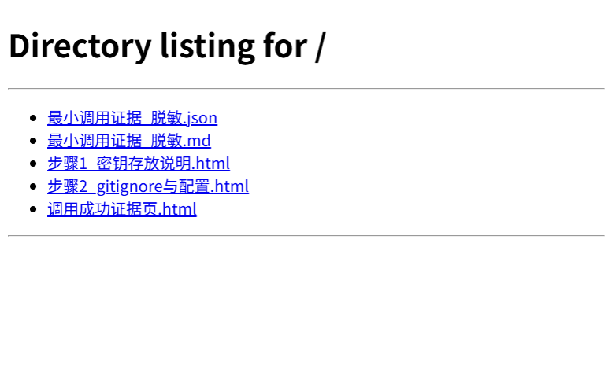
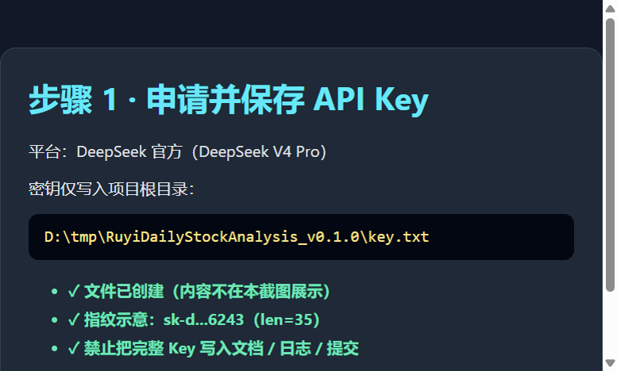
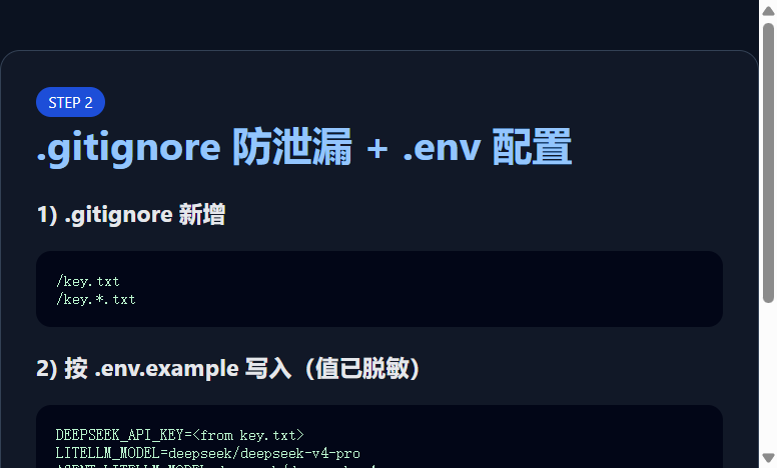
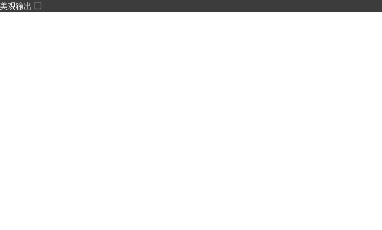

# 本项目如何配置大模型

> 练习 3 实操记录（DeepSeek V4 Pro）  
> 安全原则：完整 API Key **只**保存在项目根目录 `key.txt`，并已加入 `.gitignore`；本文与截图仅出现脱敏指纹。

## 0. 产出与证据位置

| 路径 | 说明 |
|------|------|
| `key.txt` | 本地密钥（禁止提交） |
| `.env` | 运行时配置（已 gitignore） |
| `大模型/证据/` | 脱敏调用证据与截图 |
| `docs/LLM_CONFIG_GUIDE.md` | 官方配置手册 |

证据目录一览：



---

## 1. 步骤一：申请 Key 并仅写入 `key.txt`

1. 在 [DeepSeek 开放平台](https://platform.deepseek.com) 创建 API Key（本练习使用 **DeepSeek V4 Pro**）。
2. 在项目根目录创建 `key.txt`，**只放一行 Key**，不要加引号、不要写进 Markdown。
3. 文档与截图只保留指纹：`sk-d...6243 (len=35)`。



---

## 2. 步骤二：防泄漏 + 按 `.env.example` 配置

### 2.1 写入 `.gitignore`

已在仓库根目录 `.gitignore` 增加：

```gitignore
# 本地 API Key 练习文件（禁止提交）
/key.txt
/key.*.txt
```

（`.env` 本身原先就已忽略。）

### 2.2 写入 `.env`（新手单 Key 模式）

依据 `.env.example` 与 `docs/LLM_CONFIG_GUIDE.md`，本练习采用**单 Key 模式**（不要同时开 `LLM_CHANNELS`，否则顶层 `DEEPSEEK_API_KEY` 会被忽略）：

```env
DEEPSEEK_API_KEY=<from key.txt>
LITELLM_MODEL=deepseek/deepseek-v4-pro
AGENT_LITELLM_MODEL=deepseek/deepseek-v4-pro
GENERATION_BACKEND=litellm
```

说明：

- LiteLLM 模型名需要带 provider 前缀：`deepseek/deepseek-v4-pro`
- `AGENT_LITELLM_MODEL` 专供问股 Agent；留空会继承 `LITELLM_MODEL`
- 若以后要控成本，主分析可改为 `deepseek/deepseek-v4-flash`，Agent 继续用 `deepseek-v4-pro`



### 2.3 自动化配置脚本（本地）

本次用脚本从 `key.txt` 同步到 `.env` 并做最小调用（不会在终端打印完整 Key）：

```bat
.\.venv\Scripts\python.exe logs\configure_deepseek.py
```

---

## 3. 步骤三：最小调用验证（必须成功）

### 3.1 调用方式

- Endpoint：`https://api.deepseek.com/chat/completions`
- Model：`deepseek-v4-pro`
- Prompt：要求模型回复「DeepSeek V4 Pro 最小调用成功」

### 3.2 结果（脱敏）

| 项 | 值 |
|----|----|
| 结果 | **成功** |
| 时间 | 2026-07-17T08:51:44 → 08:51:47 |
| 模型回复 | DeepSeek V4 Pro 最小调用成功 |
| Token | prompt=25 / completion=35 / total=60 |
| Key 指纹 | sk-d...6243（已脱敏） |

完整脱敏 JSON / Markdown：

- `大模型/证据/最小调用证据_脱敏.json`
- `大模型/证据/最小调用证据_脱敏.md`


---

## 4. 配置生效后如何使用 Web

本地服务健康检查：



工作台首页（可在此发起个股分析；问股页走 Agent）：


常用启动：

```bat
start.bat
```

或：

```bat
.\.venv\Scripts\python.exe main.py --serve-only --host 127.0.0.1 --port 8000
```

也可在 Web **系统设置 → AI 模型** 中可视化调整渠道与模型（保存后仍写入 `.env`）。

---

## 5. 进阶：多渠道模式（可选，本练习未启用）

```env
LLM_CHANNELS=deepseek
LLM_DEEPSEEK_BASE_URL=https://api.deepseek.com
LLM_DEEPSEEK_API_KEY=<from key.txt>
LLM_DEEPSEEK_MODELS=deepseek-v4-flash,deepseek-v4-pro
LITELLM_MODEL=deepseek/deepseek-v4-flash
AGENT_LITELLM_MODEL=deepseek/deepseek-v4-pro
```

注意：一旦启用 `LLM_CHANNELS`，外面的 `DEEPSEEK_API_KEY` 会被忽略。二者只选一种。

---

## 6. 安全检查清单

- [x] Key 只在 `key.txt` / `.env`
- [x] `key.txt`、`.env` 已在忽略规则中
- [x] 文档与截图无完整 Key
- [x] 最小调用成功且证据已脱敏
- [x] 未在回复、日志、提交物中打印完整密钥

---

## 7. 详细操作时间线（本机实操）

1. 创建 `key.txt`（DeepSeek V4 Pro Key）
2. 更新 `.gitignore` 增加 `/key.txt`
3. 运行 `logs\configure_deepseek.py`：写入 `.env` + 发起最小 Chat Completions
4. 生成 `大模型/证据/*` 脱敏材料与截图页
5. 用本地 `http://127.0.0.1:8765` 打开证据页并截图归档
6. 确认 Web `http://127.0.0.1:8000/api/health` 返回 `status=ok`
